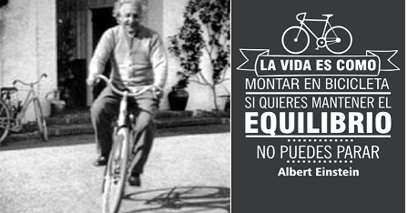

# Mi biografia
## Datos Personales
**Nombres:** *Ruben Mamani T.*

**C.I.:** *45457685 lP.*

**Fecha de Nacimiento:** *17 de Diciembre de 1983*

**Lugar de nacimineto:** *La Paz - Murillo, Bolivia*

**Email:** *ruben.inf1208@gmail.com*

## Antecedentes Academicos
> Estudios realizados

* 2017 - Nov    Titulo, Ing Geografo, Universidad Mayor de San Andres, La Paz - Bolivia.

* 2019 - Oct    Diplomado, Diplomado en Sistemas de Informacion Geografica, Carrera de Ingeria Geografica, Universidad Mayor de San Andres, La Paz - Bolivia.

> Cursos y seminarios Realizados

1. Taller: Sistemas de informacion Geografica, UPEA, carrera de ingenieria de sistemas, del 07 al 11 de noviembre de 2022.

2. Curso: Teledeteccion Aplicada (Google Earth Engine y Colab), UMSA facultad de Ciencias Geologcas, del 20 de septiembre al 11 de octubre de 2021.

3. Curso de SIG con Qgis v3, UnaYakuy consultores SRL. del 16 de marzo al 10 de abril de 2020.

> Frase motivacional:

